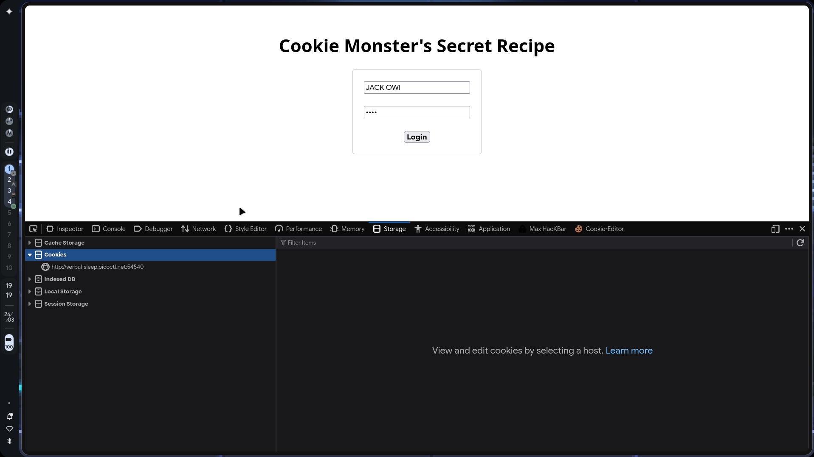
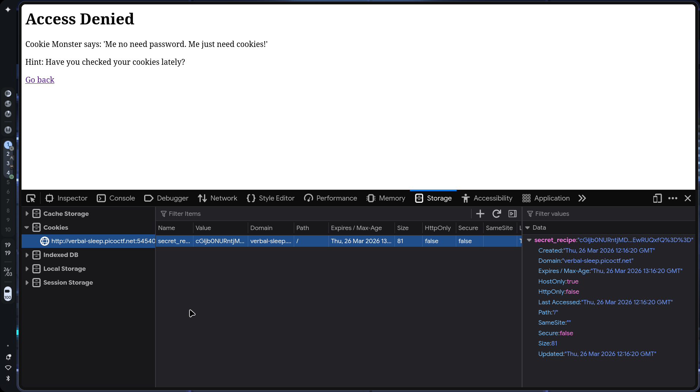
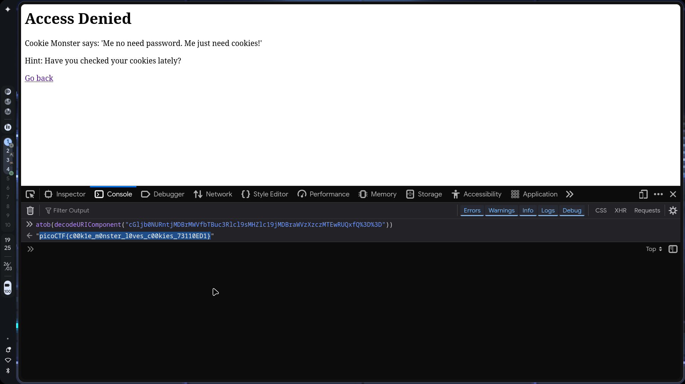
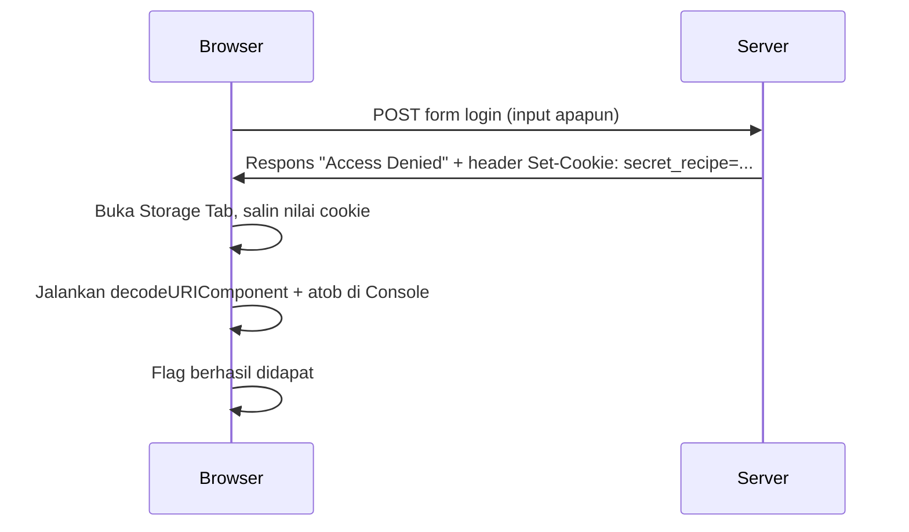

# PicoCTF: Cookie Monster's Secret Recipe

- **Category:** Web Exploitation
- **Difficulty:** Easy
- **Tools Used:** Web Browser (Storage Inspector), JavaScript Console
- **Main Techniques:** Cookie Manipulation, Authentication Bypass, URL Decoding, Base64 Decoding

---

## Attack Context

- **Kapan teknik ini dipakai?** Tahap *Initial Access* — ketika ada data sensitif yang disimpan langsung di sisi klien tanpa perlindungan enkripsi.
- **Syarat yang dibutuhkan:** Akses ke halaman web yang memicu server untuk mengirimkan respons `Set-Cookie`, misalnya melalui form login.
- **Tanda keberhasilan:** Cookie baru muncul di tab *Storage*, nilainya bisa di-decode, dan menghasilkan flag atau data sensitif yang valid.

---

## Enumeration

### Cara Kerja Cookie & HTTP Stateless

Kenapa data penting bisa tergeletak begitu saja di cookie browser?

Akar masalahnya ada di sifat dasar protokol HTTP, yaitu **stateless** — setiap permintaan dari browser ke server diproses secara independen. Server tidak menyimpan riwayat sesi sebelumnya. Begitu server selesai merespons, koneksi putus dan server lupa siapa yang baru saja terhubung.

> **for your information:** **Stateless** berarti setiap HTTP request berdiri sendiri. Server tidak menyimpan konteks dari request sebelumnya, sehingga setiap request harus membawa informasi identifikasi sendiri.

Untuk menyiasati ini, server mengirimkan **cookie** — sepotong data yang disimpan di browser klien dan dikirim ulang secara otomatis di setiap request berikutnya. Mekanisme ini memungkinkan server mengenali siapa yang sedang berkomunikasi dengannya.

Masalah muncul ketika developer menyimpan data sensitif langsung di dalam nilai cookie, bukan sekadar ID sesi acak. Karena cookie tersimpan di sisi klien, siapapun yang memiliki akses ke browser bisa membaca, menyalin, atau memodifikasi isinya melalui Developer Tools.

### Memicu Server Mengirimkan Cookie

Halaman utama challenge menampilkan form login sederhana dengan field input untuk username dan password. Halaman login Cookie Monster tidak melakukan validasi password ke database. Form login-nya hanya berfungsi sebagai pemicu, ketika form di-submit, server merespons dengan header `Set-Cookie` yang menanamkan cookie `secret_recipe` ke browser, terlepas dari apakah login berhasil atau tidak.



Submit form dengan input apapun. Halaman akan menampilkan pesan *"Access Denied"*, tapi di balik itu server sudah mengirimkan cookie target ke browser.

---

## Exploitation

### Cek Nilai di Storage Tab

Buka **Developer Tools → Storage → Cookies**, lalu klik domain target. Cookie bernama `secret_recipe` akan muncul dengan value berikut:



```
cGljb0NURntjMDBrMWVfbTBuc3Rlcl9sMHZlc19jMDBraWVzXzczMTEwRUQxfQ%3D%3D
```

Nilai ini menggunakan **double encoding**: isinya adalah string Base64 yang kemudian di-encode ulang dengan URL Encoding. Karakter `%3D` adalah representasi URL-encoded dari simbol `=` yang dipakai sebagai padding di Base64.

> **Common Mistake:** Base64 dan URL Encoding adalah **encoding**, bukan **enkripsi**. Encoding hanya mengubah format representasi data agar aman ditransmisikan, prosesnya sepenuhnya reversibel tanpa membutuhkan kunci rahasia apapun. Jangan keliru menyebutnya sebagai enkripsi.

### Bongkar Double Encoding

Buka tab **Console** di Developer Tools, lalu jalankan one-liner berikut:



```javascript
atob(decodeURIComponent("cGljb0NURntjMDBrMWVfbTBuc3Rlcl9sMHZlc19jMDBraWVzXzczMTEwRUQxfQ%3D%3D"))
```

Bedah per komponen:

| Komponen | Fungsi |
| :--- | :--- |
| `decodeURIComponent(...)` | **Tahap 1:** Membalikkan URL Encoding — mengubah `%3D%3D` menjadi `==` sehingga string Base64-nya valid. |
| `atob(...)` | **Tahap 2:** Mendecode string Base64 menjadi plaintext yang bisa dibaca. |

Output yang dihasilkan:

```
picoCTF{c00k1e_m0nster_l0ves_c00kies_73110ED1}
```

---

## Attack Flow Summary



---

## Review

- Cookie yang menyimpan data sensitif secara langsung di sisi klien membuka celah bagi siapapun untuk membaca atau memodifikasi nilainya tanpa perlu akses ke server.
- **Encoding bukan enkripsi** — Base64 dan URL Encoding tidak memberikan perlindungan kerahasiaan apapun. Data yang di-encode bisa dikembalikan ke bentuk aslinya oleh siapapun tanpa kunci.
- Double encoding (`Base64 + URL Encoding`) hanya mempersulit pembacaan secara visual, bukan secara kriptografis — satu one-liner JavaScript sudah cukup untuk meruntuhkannya.
