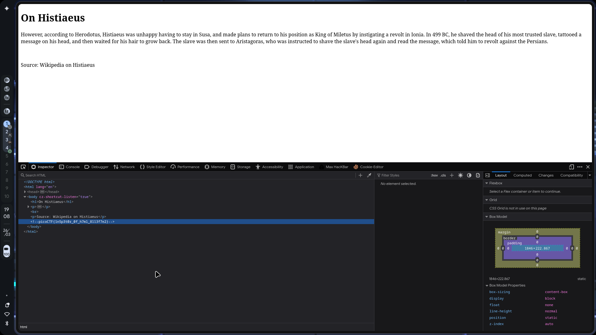
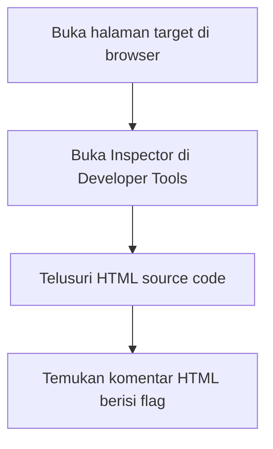

# PicoCTF: Inspect HTML

- **Category:** Web Exploitation
- **Difficulty:** Easy
- **Tools Used:** Web Browser (Developer Tools / Inspector)
- **Main Techniques:** Source Code Review, HTML Comment Analysis

---

## Attack Context

- **Kapan teknik ini dipakai?** Tahap *Reconnaissance* awal — sebelum mencoba teknik apapun yang lebih kompleks, selalu periksa source code halaman target terlebih dahulu.
- **Syarat yang dibutuhkan:** Cukup akses browser biasa ke halaman web target. Tidak perlu tools khusus.
- **Tanda keberhasilan:** Menemukan flag, kredensial, atau komentar developer yang tidak sengaja dibiarkan terbuka di source code.

---

## Reconnaissance

### HTML Source Code & Developer Comments

Apa yang kamu lihat di browser — teks, tombol, gambar — adalah hasil rendering dari source code HTML. Browser membaca kode itu, lalu menampilkan versi visualnya. Yang tidak ditampilkan adalah **komentar HTML**: blok teks yang sengaja diabaikan oleh browser dan tidak pernah muncul di halaman.

```html
<!-- Ini contoh teks yang di comment -->
```

Developer sering memakai komentar untuk mencatat sesuatu — debug sementara, penanda konfigurasi, atau credential yang "cuma sementara" tapi lupa dihapus. Karena tidak tampil di UI, banyak yang lupa bahwa komentar ini tetap bisa dibaca siapapun yang membuka source code-nya.

Halaman challenge "On Histiaeus" tampilannya seperti artikel sejarah biasa — tidak ada tombol aneh atau tautan tersembunyi. Tapi buka **Inspector** di Developer Tools, lalu perhatikan bagian bawah HTML-nya.



Tepat di bawah paragraf penutup artikel, ada satu komentar HTML yang langsung memuat flag-nya:

`<!--picoCTF{1n5p3t0r_0f_h7ml_8113f7e2}-->`

> **Common Mistake:** Pemula sering terlalu fokus mengklik elemen di halaman, tapi melewatkan source code-nya. Celah paling sederhana justru sering tersembunyi di sana — tanpa perlindungan apapun.

---

## Attack Flow Summary



---

## Review

- Source code HTML selalu bisa diakses publik — apapun yang developer tulis di sana, termasuk komentar, bisa dibaca siapapun.
- Komentar HTML tidak tampil di halaman, tapi tidak berarti tersembunyi. Browser menyembunyikannya dari tampilan, bukan dari akses.
- Reconnaissance web yang benar selalu dimulai dari membaca source code sebelum mencoba teknik lain yang lebih kompleks.
