# TryHackMe: Simple CTF Challenge

- **Room Link:** [Simple CTF Challenge](https://tryhackme.com/room/simplectfchallenge)
- **Category:** Challenge Room
- **Difficulty:** Easy
- **Tools Used:** Nmap, FTP client, Gobuster, Searchsploit, CVE-2019-9053 exploit (Python), Hydra, SSH, Vim
- **Main Techniques:** Port scanning, anonymous FTP enumeration, directory brute force, exploit research, SQL injection (CMS Made Simple), SSH brute force, privilege escalation via sudo vim

---

## Attack Context

- **Kapan teknik ini dipakai?** Tahap _Recon_ sampai _Privilege Escalation_ — room ini mencakup seluruh attack chain dari awal hingga root.
- **Syarat yang dibutuhkan:** Koneksi ke jaringan TryHackMe (VPN atau AttackBox) dan IP target.
- **Tanda keberhasilan:** Mendapatkan _user flag_ (`user.txt`) dan _root flag_ (`root.txt`).

---

## Reconnaissance

### Nmap Scan

Langkah pertama adalah mengidentifikasi service yang berjalan di target.

```
nmap -sC -sV MACHINE_IP
```

| Komponen | Fungsi |
| :--- | :--- |
| `nmap` | Tool scanner jaringan |
| `-sC` | Menjalankan _default scripts_ (NSE) untuk menggali info tambahan dari tiap service |
| `-sV` | Mendeteksi versi service yang berjalan |


Hasilnya menunjukkan tiga port terbuka:

| Port | Service | Version | Catatan |
| :--- | :--- | :--- | :--- |
| 21/tcp | FTP | vsftpd 3.0.3 | **Anonymous login allowed** |
| 80/tcp | HTTP | Apache 2.4.18 (Ubuntu) | `robots.txt` memiliki 2 entri, termasuk `/openemr-5_0_1_3` |
| 2222/tcp | SSH | OpenSSH 7.2p2 | Port non-standar (biasanya SSH di port 22) |

Tiga hal itu memberikan petunjuk:
- **FTP mengizinkan anonymous login** — siapa saja bisa masuk tanpa password. Ini harus dieksplorasi pertama.
- **`robots.txt`** menyebutkan path `/openemr-5_0_1_3` — ini petunjuk bahwa ada aplikasi web yang terinstall.
- **SSH di port 2222**, bukan port default 22. Ini penting untuk diingat saat nanti login via SSH.

> **Common Mistake:** Banyak pemula hanya fokus ke port 80 (HTTP) dan mengabaikan FTP. Padahal anonymous FTP seringkali menyimpan file sensitif yang jadi kunci untuk lanjut ke tahap berikutnya.

---

## Enumeration

### FTP Anonymous Login

Nmap sudah mengonfirmasi FTP mengizinkan _anonymous login_. Langsung masuk:

```
ftp MACHINE_IP
```

Saat diminta username, ketik `anonymous` dan tekan Enter (password kosong atau ketik apapun).

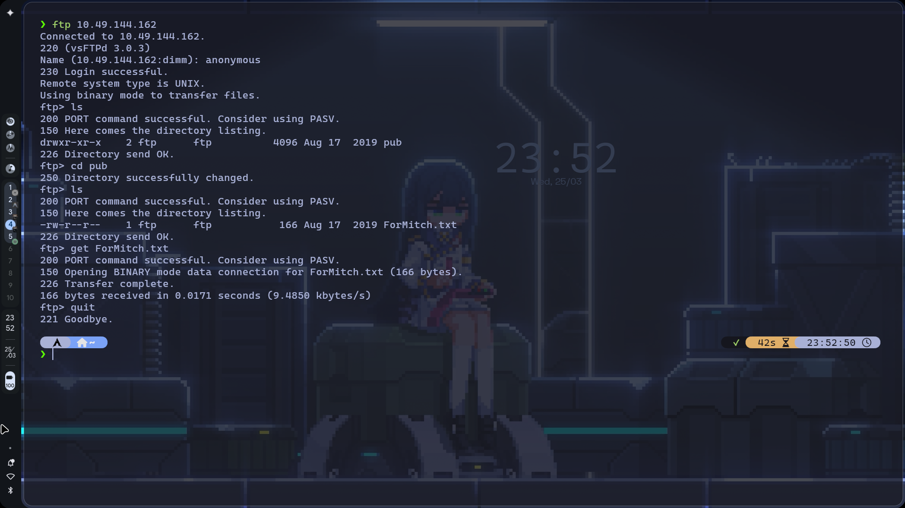

| Command | Fungsi |
| :--- | :--- |
| `ls` | Melihat isi direktori di FTP server |
| `cd pub` | Masuk ke folder `pub` |
| `get ForMitch.txt` | Mengunduh file `ForMitch.txt` ke mesin lokal |
| `quit` | Menutup koneksi FTP |

Di dalam folder `pub/` hanya ada satu file: `ForMitch.txt`. Setelah diunduh dan dibaca:

```
cat ForMitch.txt
```

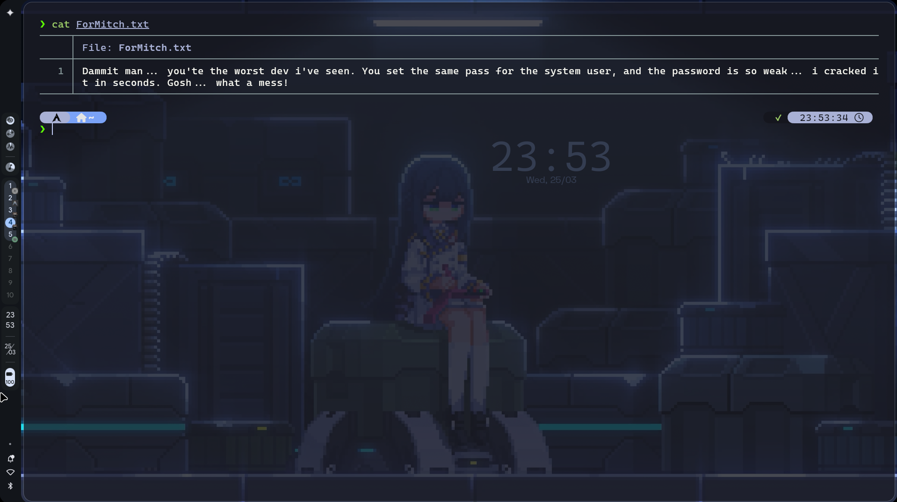

Isinya:

> _"Dammit man... you're the worst dev i've seen. You set the same pass for the system user, and the password is so weak... i cracked it in seconds. Gosh... what a mess!"_

Informasi berharga dari pesan ini:
- Ada user bernama **Mitch** (file ditujukan untuk dia).
- Password system user-nya **sama dengan password di tempat lain** (_credential reuse_).
- Password-nya **sangat lemah**, bisa di-crack dalam hitungan detik.

### Web Application — CMS Made Simple

Sekarang pindah ke port 80. Buka `http://MACHINE_IP` di browser dan yang muncul hanyalah halaman default Apache.

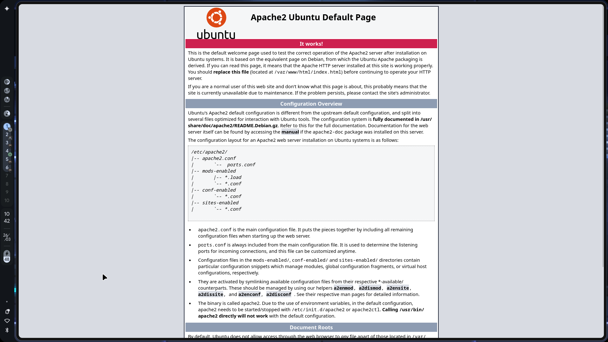

Path `/openemr-5_0_1_3` dari `robots.txt` juga tidak memberikan hasil yang berguna. Untuk menemukan direktori tersembunyi, gunakan **Gobuster**:

> **for your information:** **Gobuster** adalah tool directory/file brute force yang mengirim HTTP request ke path-path dari wordlist untuk menemukan halaman atau direktori yang tidak di-link dari halaman utama.

```
gobuster dir -u http://MACHINE_IP -w /home/dimm/SecLists/Discovery/Web-Content/common.txt
```

| Komponen | Fungsi |
| :--- | :--- |
| `gobuster` | Tool directory brute force |
| `dir` | Mode directory enumeration |
| `-u` | Target URL |
| `-w` | Path ke wordlist |

Sesuaikan path wordlist dengan lokasi instalasi SecLists di sistemmu.

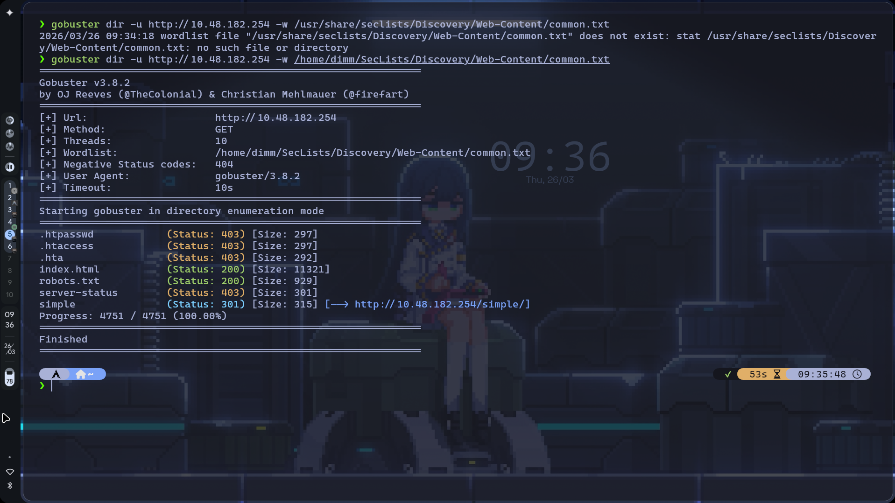

Gobuster menemukan beberapa path, tapi yang paling menarik:

```
/simple    (Status: 301) [Size: 315] [--> http://MACHINE_IP/simple/]
```

Akses `http://MACHINE_IP/simple/` di browser:

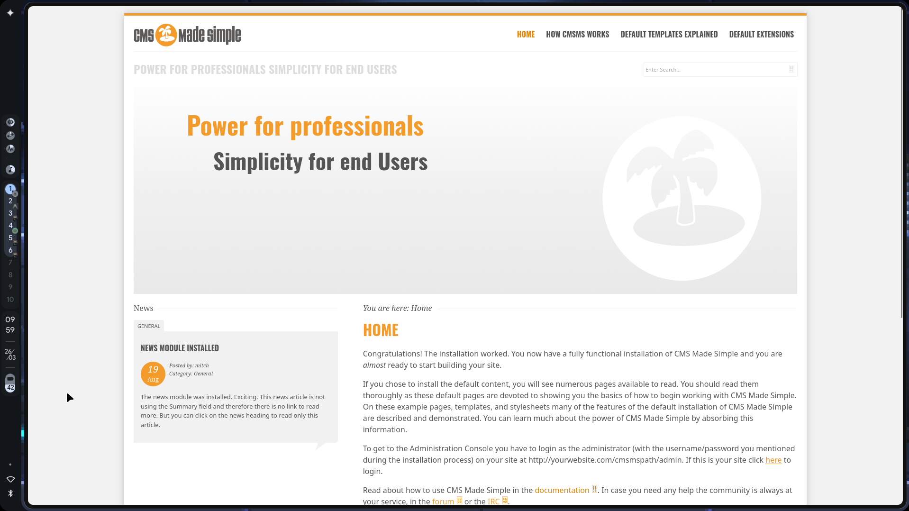

Ternyata ini adalah **CMS Made Simple** — sebuah _Content Management System_ berbasis PHP. Di halaman ini juga terlihat ada post dari user **mitch** (informasi ini mengonfirmasi username yang kita dapat dari `ForMitch.txt`).

Scroll ke bagian paling bawah halaman untuk melihat footer:

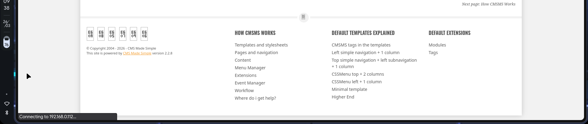

Footer menunjukkan: _"This site is powered by CMS Made Simple version **2.2.8**"_. Versi 2.2.8 berarti **lebih rendah dari 2.2.10** — ini rentan terhadap CVE-2019-9053.

---

## Exploitation

### Mencari Exploit yang Tepat

Setelah tahu CMS Made Simple versi 2.2.8 terpasang, langkah berikutnya adalah mencari exploit publik. Ada dua cara yang dipakai:

**Cara 1: Google Search**

Cari keyword seperti `cms made simple exploit` di Google.

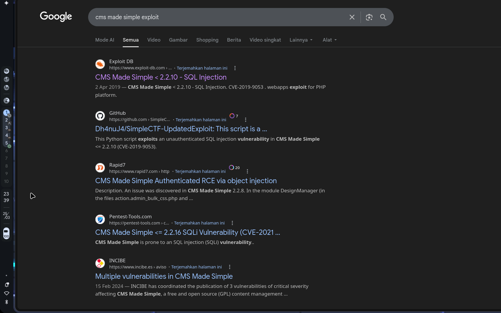

Hasil pertama langsung mengarah ke Exploit Database — **CMS Made Simple < 2.2.10 - SQL Injection** (CVE-2019-9053).

**Cara 2: Searchsploit (Offline)**

> **for your information:** **Searchsploit** adalah tool command-line untuk mencari exploit dari database lokal Exploit-DB. Berguna saat kamu butuh cari exploit tanpa koneksi internet, atau ingin melihat semua exploit yang tersedia untuk satu target sekaligus.

```
searchsploit cms made simple
```

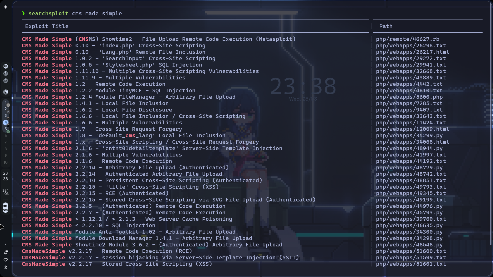

Output-nya menampilkan puluhan exploit untuk berbagai versi CMS Made Simple. Yang relevan ada di baris paling bawah: **CMS Made Simple < 2.2.10 – SQL Injection** (path: `php/webapps/46635.py`).

### CVE-2019-9053: SQL Injection on CMS Made Simple

Kerentanan **CVE-2019-9053** mempengaruhi CMS Made Simple versi di bawah 2.2.10. Exploit ini memungkinkan _Unauthenticated SQL Injection_ — penyerang bisa mengekstrak data dari database **tanpa perlu login** ke aplikasi.


> **for your information:** **SQL Injection** (_SQLi_) adalah kerentanan di mana input dari user diproses langsung sebagai bagian dari query database tanpa sanitasi yang benar. Penyerang bisa menyisipkan perintah SQL tambahan untuk membaca, mengubah, atau menghapus data di database.

| Item | Detail |
| :--- | :--- |
| **CVE** | CVE-2019-9053 |
| **EDB-ID** | 46635 |
| **Tipe** | Unauthenticated SQL Injection |
| **Platform** | PHP (Web Application) |
| **Versi Rentan** | CMS Made Simple < 2.2.10 |

### Running the Exploit

Jalankan script exploit `46635.py` dengan target path `/simple` (yang kamu temukan lewat Gobuster tadi):

```
python2 46635.py -u http://MACHINE_IP/simple --crack -w /home/dimm/SecLists/Passwords/Common-Credentials/10k-most-common.txt
```

| Komponen | Fungsi |
| :--- | :--- |
| `python2` | Menjalankan script dengan Python 2 (script ini ditulis untuk Python 2) |
| `46635.py` | Script exploit SQLi dari Exploit Database |
| `-u` | URL target CMS Made Simple (path `/simple`) |
| `--crack` | Aktifkan mode cracking — otomatis crack hash setelah diekstrak |
| `-w` | Wordlist untuk cracking password hash |

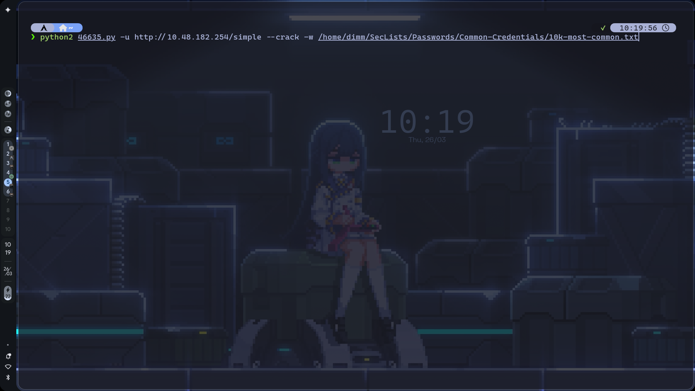

Exploit ini bekerja dengan teknik _blind SQLi_ / _time-based SQLi_ — mengirim request berulang ke endpoint yang rentan dan mengekstrak data karakter per karakter. Prosesnya memakan waktu beberapa menit.

> **Common Mistake:** Script ini ditulis untuk **Python 2**, bukan Python 3. Kalau dijalankan dengan `python3`, akan error karena perbedaan syntax (`print` statement, library `urllib`, dll). Pastikan pakai `python2`.

### Exploit Output

Setelah selesai, exploit menampilkan seluruh data yang berhasil diekstrak dari database:

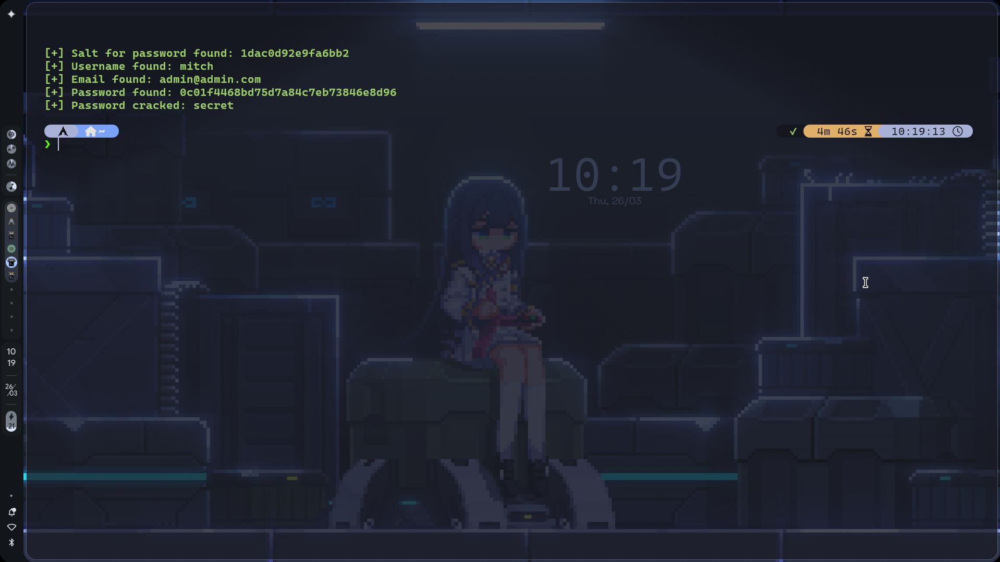

```
[+] Salt for password found: 1dac0d92e9fa6bb2
[+] Username found: mitch
[+] Email found: admin@admin.com
[+] Password found: 0c01f4468bd75d7a84c7eb73846e8d96
[+] Password cracked: [REDACTED]
```

| Output | Penjelasan |
| :--- | :--- |
| **Salt** | Nilai random yang ditambahkan ke password sebelum di-hash, untuk mencegah rainbow table attack |
| **Username** | `mitch` — mengonfirmasi clue dari `ForMitch.txt` |
| **Email** | `admin@admin.com` — email admin CMS |
| **Password (hash)** | MD5 hash dari password + salt |
| **Password cracked** | Hasil cracking — flag `--crack` otomatis mencocokkan hash dengan wordlist |

Script ini menangani semuanya secara otomatis: ekstraksi data via SQLi **dan** cracking hash dalam satu langkah. Password yang ditemukan sangat lemah, sesuai petunjuk `ForMitch.txt`.

---

## Initial Access

Dari clue `ForMitch.txt`, kamu sudah punya dua informasi penting: username kemungkinan **mitch** dan password-nya **sangat lemah**. Dengan informasi ini, ada dua pendekatan untuk mendapatkan credential SSH — keduanya valid dan menghasilkan password yang sama.

### Approach 1: Hydra SSH Brute Force

Pendekatan paling langsung: karena sudah tahu username dan password lemah, brute force SSH secara langsung.

> **for your information:** **Hydra** adalah tool brute force yang mendukung berbagai protokol (SSH, FTP, HTTP, dll). Hydra mencoba login secara otomatis menggunakan kombinasi username dan password dari wordlist.

```
sudo hydra -l mitch -P /home/dimm/Downloads/rockyou.txt ssh://MACHINE_IP -s 2222 -t 4
```

| Komponen | Fungsi |
| :--- | :--- |
| `hydra` | Tool brute force login |
| `-l mitch` | Username target (lowercase `-l` = single username) |
| `-P rockyou.txt` | Path ke wordlist password (uppercase `-P` = password list) |
| `ssh://MACHINE_IP` | Protokol dan target |
| `-s 2222` | Menentukan port service (SSH di port non-standar) |
| `-t 4` | Jumlah thread paralel (4 koneksi simultan) |

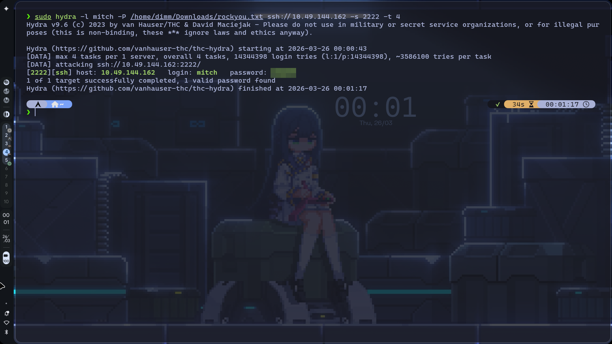

Hydra berhasil menemukan credential: **login: `mitch`** — **password: `[REDACTED]`**. Pendekatan ini cepat dan langsung ke sasaran.

> **Common Mistake:** Jangan lupa flag `-s` untuk menentukan port kustom. Tanpa `-s 2222`, Hydra akan mencoba SSH di port 22 (default) dan gagal koneksi.

### Approach 2: SQLi Exploit (CVE-2019-9053)

Pendekatan ini memberikan hasil yang lebih kaya. Selain password, exploit juga mengekstrak **username CMS**, **email**, **salt**, dan **password hash** dari database — informasi yang berguna untuk investigasi lebih dalam atau serangan lanjutan. Detail lengkap ada di section [Exploitation](#exploitation) di atas.

Kedua pendekatan menghasilkan credential yang sama. Perbedaannya: Hydra hanya menemukan password, sedangkan SQLi exploit membongkar seluruh isi database CMS.

### SSH Login as Mitch

Dengan credential yang sudah didapat (dari pendekatan manapun), login via SSH:

```
ssh -p 2222 mitch@MACHINE_IP
```

| Komponen | Fungsi |
| :--- | :--- |
| `ssh` | Memulai koneksi SSH |
| `-p 2222` | Menentukan port SSH (non-standar, bukan port 22) |
| `mitch` | Username target |
| `@MACHINE_IP` | IP mesin target |

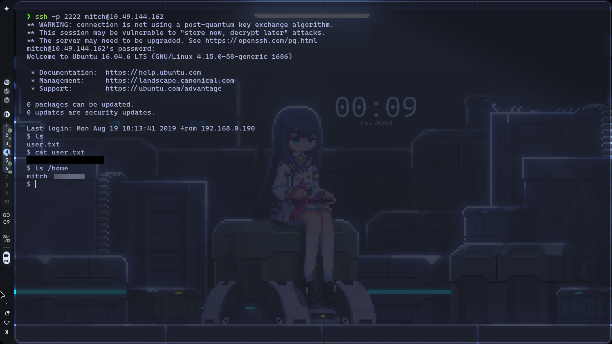

Login berhasil. Langsung ambil _user flag_:

```
$ ls
user.txt
$ cat user.txt
[FLAG]
```

Untuk menjawab pertanyaan room tentang user lain di home directory:

```
$ ls /home
mitch  sunbath
```

Ada satu user lain: **sunbath**.

---

## Privilege Escalation

### Sudo Vim to Root Shell

Sebelum mencoba apapun, selalu cek dulu hak `sudo` yang dimiliki user saat ini:

```
sudo -l
```

| Komponen | Fungsi |
| :--- | :--- |
| `sudo` | Menjalankan command dengan hak akses lebih tinggi |
| `-l` | Menampilkan daftar command yang boleh dijalankan user ini via `sudo` |

Output-nya menunjukkan bahwa `mitch` boleh menjalankan `/usr/bin/vim` sebagai root **tanpa password** (`NOPASSWD`). Ini artinya vim jadi vektor privilege escalation yang valid.

> **for your information:** **Vim** adalah text editor di terminal Linux. Tapi vim punya fitur yang bisa dimanfaatkan untuk escalation: dari dalam vim, kamu bisa menjalankan command sistem dengan `:!command`. Jika vim dijalankan dengan `sudo`, command yang dieksekusi juga berjalan sebagai root. Teknik ini terdokumentasi di [GTFOBins - vim](https://gtfobins.github.io/gtfobins/vim/).

Jalankan vim dengan sudo:

```
sudo vim
```

Kemudian dari dalam vim, spawn shell root:

```
:!bash
```

Atau alternatif yang lebih singkat:

```
sudo vim -c ':!bash'
```

| Komponen | Fungsi |
| :--- | :--- |
| `sudo` | Menjalankan command sebagai root |
| `vim` | Membuka text editor vim |
| `-c ':!bash'` | Menjalankan command vim `:!bash` langsung saat startup |
| `:!bash` | Perintah vim untuk menjalankan `/bin/bash` sebagai subprocess |

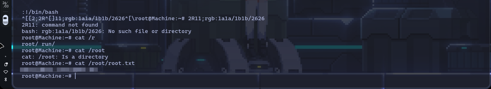

Setelah mendapat root shell, ambil root flag:

```
root@Machine:~# cat /root/root.txt
```

> **Common Mistake:** Perhatikan di screenshot bahwa proses menuju `cat /root/root.txt` tidak selalu lancar, ada beberapa percobaan `cat /r` (tab completion), `cat /root` (mengembalikan "Is a directory") sebelum akhirnya `cat /root/root.txt` berhasil membaca flag. Ini normal saat bekerja di terminal, jangan panik kalau salah ketik.

---

## Attack Flow Summary

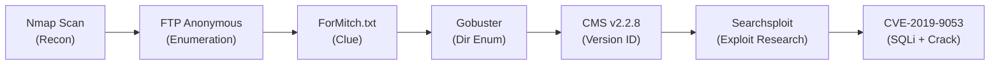

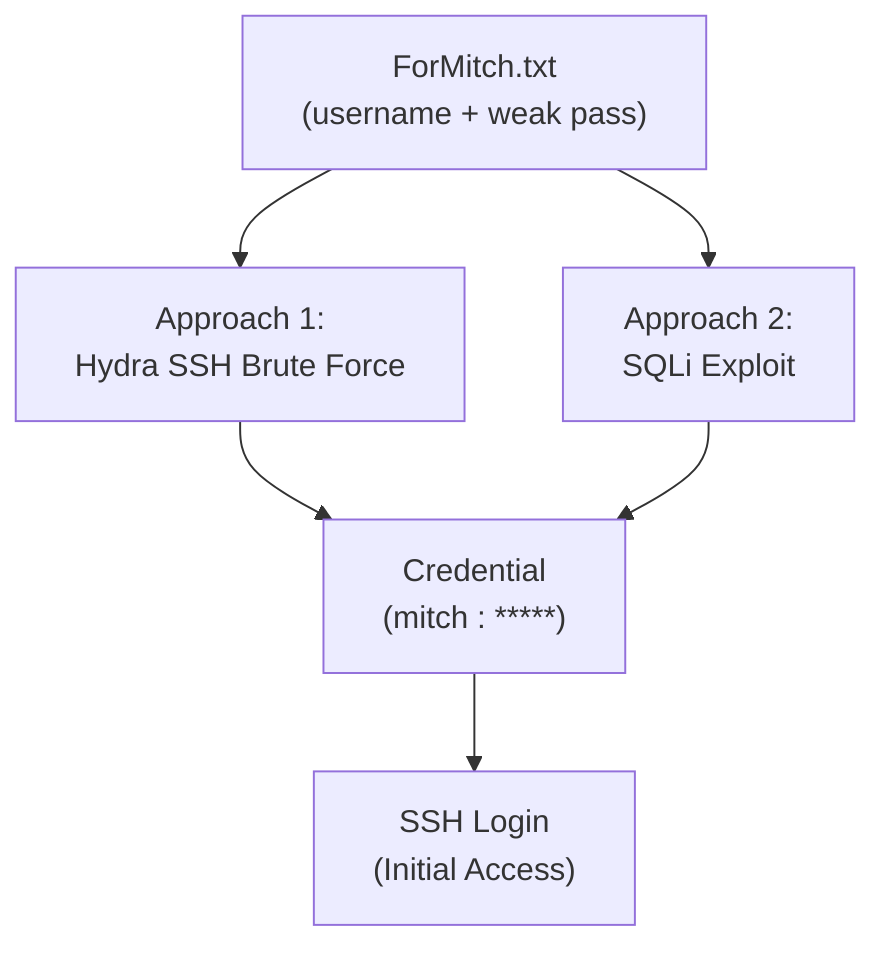

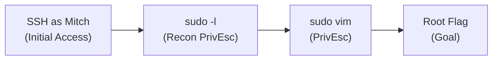

---

## Room Questions

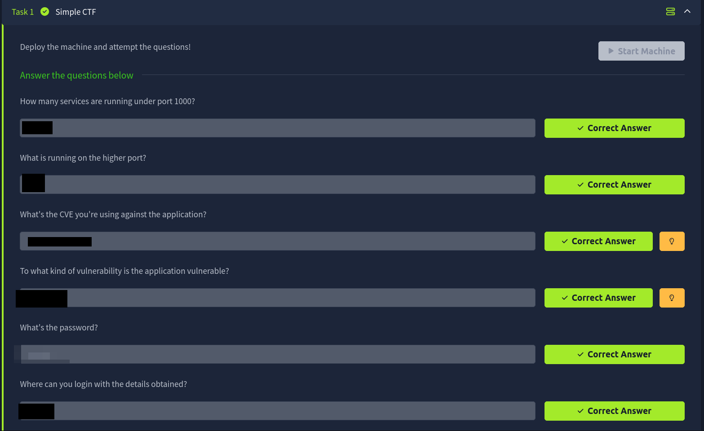

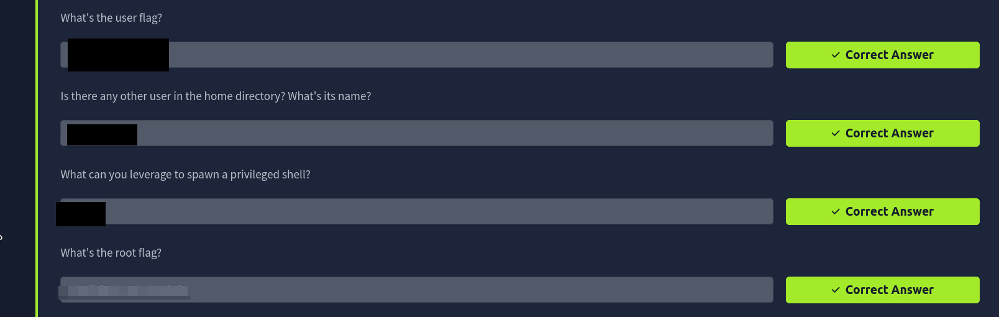

---

## Review

- **Anonymous FTP** jadi entry point utama — file `ForMitch.txt` membocorkan informasi soal _credential reuse_ dan _weak password_. Selalu periksa service FTP yang mengizinkan login tanpa autentikasi.
- **Riset exploit** bisa dilakukan lewat Google maupun `searchsploit` secara offline — keduanya mengarah ke CVE-2019-9053 (SQLi pada CMS Made Simple < 2.2.10).
- Ada dua cara mendapat credential SSH — **Hydra** brute force langsung, atau ekstraksi via **SQLi exploit**. Keduanya menghasilkan password yang sama, tapi SQLi memberikan data tambahan (username CMS, email, hash).
- **`sudo -l` wajib dicek** sebelum mencoba privilege escalation — di sini `mitch` bisa menjalankan `vim` sebagai root, yang kemudian digunakan untuk spawn shell via `:!bash`. Referensi lengkap: [GTFOBins - vim](https://gtfobins.github.io/gtfobins/vim/).
